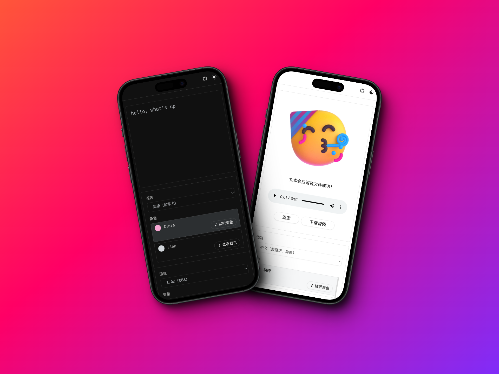

<h4 align="right">English | <strong><a href="./README_CN.md">中文</a></strong></h4>

<p align="center">
        
</p> 

<h1 align="center">AudiRead</h1>

<p align="center">
 A simple and user-friendly online text-to-speech tool. power by edge-tts.
 </p>

</p>

<p align="center">
<a href="https://audiread.app">Go to App</a>
</p>




## Roadmap

- [x] Text-to-speech
- [ ] i18n
- [ ] Add pauses in speech
- [ ] Online addition of background music
- [ ] Save history records

## Local Development

Node Environment Requirement：NodeJS >= 18

**1. Install Dependencies**

```bash
pnpm i
```

**2. Run the Project**

```bash
pnpm dev
```

**3. Build the Project**

```bash
pnpm build
```

## License

[MIT](./LICENSE)
