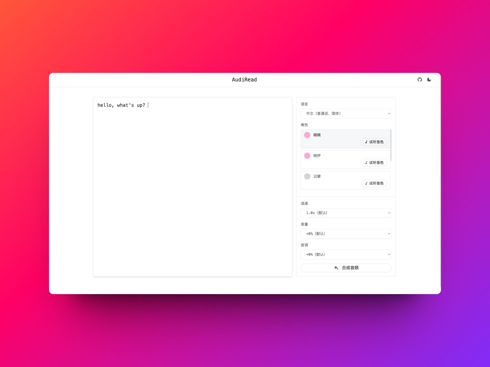
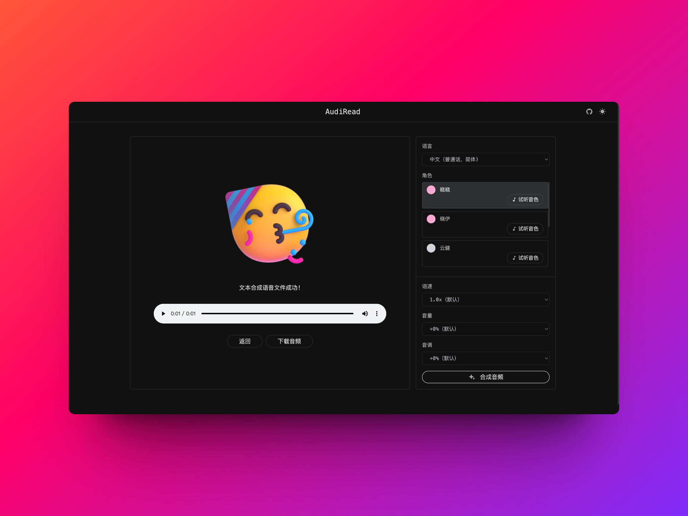
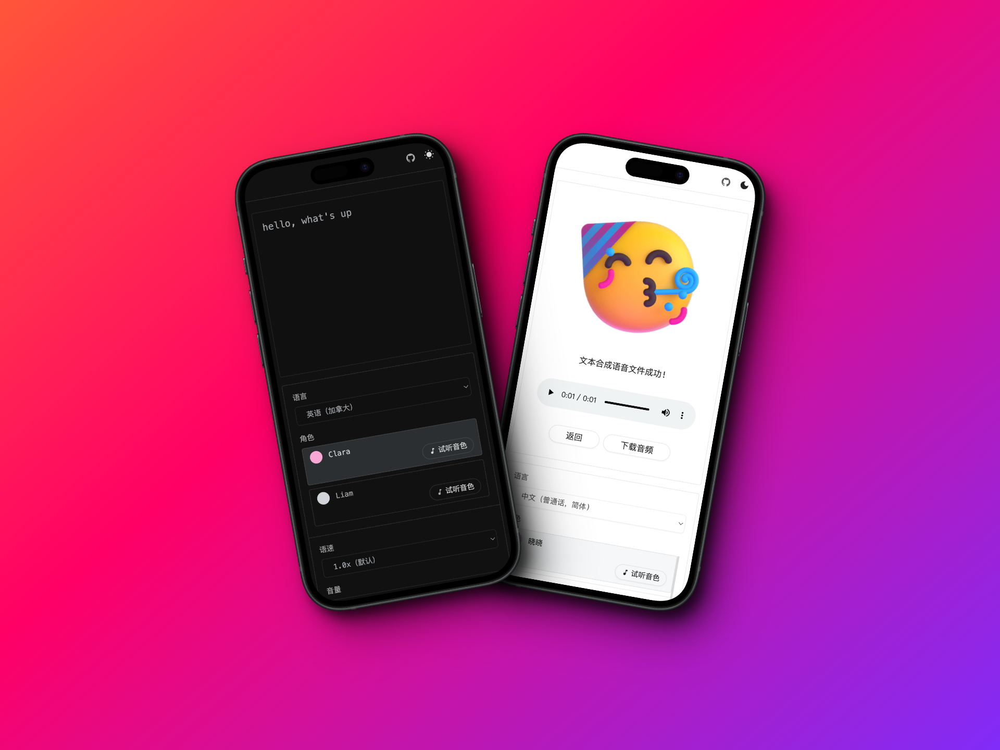

<h4 align="right"><strong><a href="./README.md">English</a></strong> | 中文</h4>

<p align="center">
  
</p>

<h1 align="center">AudiRead</h1>

<p align="center">
  一个简单易用的在线文本转语音工具，由 edge-tts 提供支持。
</p>

<p align="center">
  <a href="https://audiread.app">前往应用</a>
</p>

<p align="center">
  
  
  
</p>

## 路线图

- [x] 文本转语音
- [ ] 国际化
- [ ] 在语音中添加暂停
- [ ] 在线添加背景音乐
- [ ] 保存历史记录

## 本地开发

Node 环境要求：NodeJS >= 18

**1. 安装依赖**

```bash
pnpm i
```

**2. 运行项目**

```bash
pnpm dev
```

**3. 构建项目**

```bash
pnpm build
```

## License

[MIT](./LICENSE)

